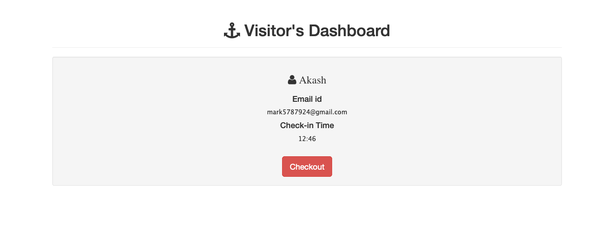

<div align="center">
	
	<h1><b>visitraccer</b></h1>
	<p><b>An interactive Entry Manager System to manage and log all the visits in an organization.</b></p>
	</br>
</div>

## About the Project

This project was made as an Assignment for the SDE Summer Internship offered by Innovaccer.

## Problem Statement

Given the visitors that we have in office and outside, there is a need to for an entry management software.

## Description of the Problem Statement

We need an application, which can capture the Name, email address, phone no of the visitor and same information also needs to be captured for the host on the front end.

At the back end, once the user enters the information in the form, the backend should store all of the information with time stamp of the entry. This should trigger an email and an SMS to the host informing him of the details of the visitor.

There should also be a provision of the checkout time which the guest can provide once he leaves. This should trigger an email to the guest with the complete form which should include:

```
1. Name
2. Phone
3. Check-in time
4. Check-out time
5. Host name
6. Address visited.
```

## Example of the intended workflow

**Visitor Details:**

```
Name - xyz
Email - xyz@xyz.com
Phone - xxxxxxxxxx
Checkin Time - 9:00 AM IST
Checkout Time - 4:00 PM IST
```

**Host Details:**

```
Name -  Lorem Ipsum
Email - lorem@xyz.com
Phone - xxxxxxxxxx
```

Once Anant checks in and enters his details in the application, Vishesh should get an email and an SMS stating the visitor details.

## Tech Stack

- **Backend** - NodeJS (Express)
- **Frontend** - Bootstrap, EJS
- **Database Used** - MongoDB
- **Major Libraries Used -**
  - **Nexmo** - Used to send mobile SMS to respective clients.
  - **Nodemailer** - Used to send mails to the respective clients.
  - **PassportJS** - Used for user authentication.

## Screenshots

||
|:-------:|
|*Landing Page*|

|*Host Registration Page*|

|*Visitor Dashboard*|

|*Visitor Registration Page*|

|*Current Check-in Dashboard*|

|*E-mail to host about upcoming visitor.*|

|*SMS to host about upcoming visitor*|

|*Email to visitor after the meeting ends.*|

## Setup

1. Install mongodb in the machine.
2. Fork the repository and clone it to the local machine.
3. Run `npm install`.
4. Make a new file with the name `.env`.
5. Write the following details in the created `.env` file :

```
EMAILADDRESS=<the sender email address>
PASSWORD=<Password generated by Gmail.>
NEXMOAPIKEY=<Nexmo API Key from the dashboard.>
NEXMOAPISECRET=<API Secret from Nexmo>
SESSIONSECRET=<Session Secret for the app>
SENDERPHONENUMBER=<Sender Phone Number for Nexmo API>
```

5. Run `nodemon server.js` and the app is live at `localhost:8080`.
